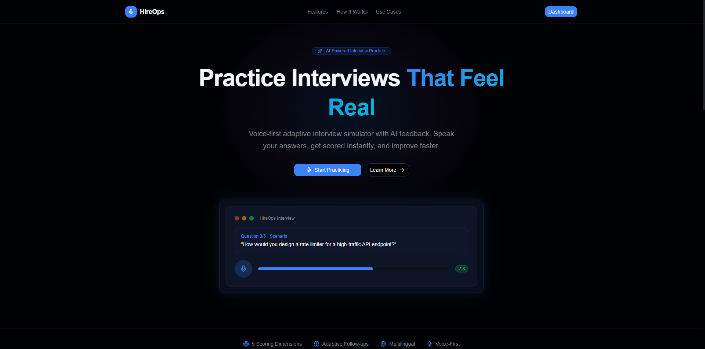
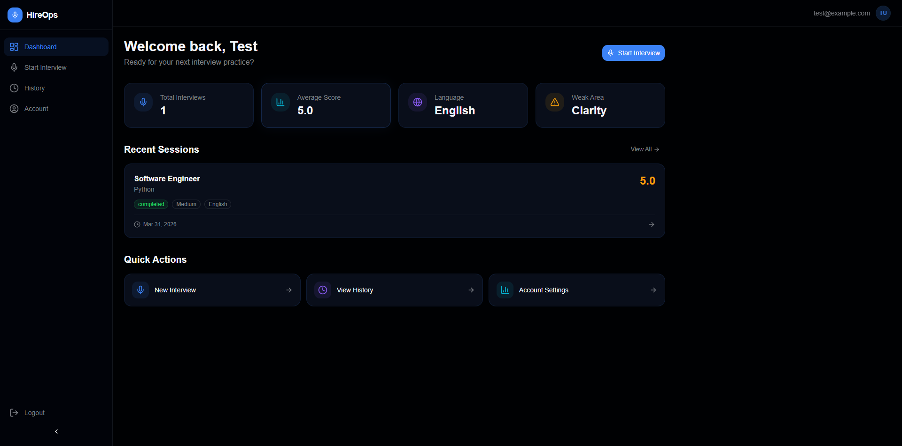
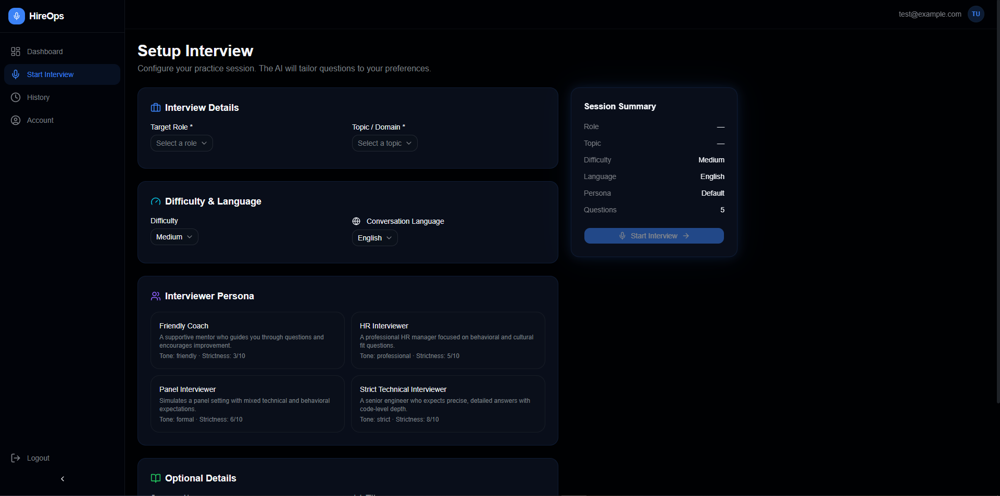

<div align="center">

# 🎙️ HireOps

**The Voice-First Adaptive Interview Simulator**

[](https://reactjs.org/)
[](https://vitejs.dev/)
[](https://www.typescriptlang.org/)
[](https://tailwindcss.com/)
[](https://supabase.com/)

_Practice seamlessly with intelligent AI avatars, receive instant spoken feedback, and walk into your next interview with confidence._

</div>

---

**HireOps** changes how candidates prepare for interviews by moving away from static text-based preparation tools to a deeply interactive, voice-first simulator. Powered by Google Gemini for real-time intelligence and Murf Falcon for rich voice delivery, HireOps provides realistic spoken interactions, dynamic follow-ups, and adaptive difficulty.

## 📑 Quick Jump Links

- [✨ Features](#-features)
- [⚙️ How It Works](#️-how-it-works)
- [📸 Screenshots](#-screenshots)
- [🛠️ Tech Stack](#️-tech-stack)
- [🧠 Interview Engine](#-interview-engine)
- [💻 Pages](#-pages)
- [📂 Project Structure](#-project-structure)
- [🗄️ Database Overview](#️-database-overview)
- [🚀 Getting Started](#-getting-started)
- [🌟 Why HireOps Stands Out](#-why-hireops-stands-out)
- [🛡️ Security Notes](#️-security-notes)

---

## ✨ Features

| Feature                        | Description                                                                                               |
| ------------------------------ | --------------------------------------------------------------------------------------------------------- |
| 🎙️ **Voice-First Interaction** | Practice with natural-sounding AI voices via Murf Falcon.                                                 |
| 🗣️ **Speech Recognition**      | Answer naturally using your microphone (or fallback to typing).                                           |
| 🧠 **Adaptive AI Follow-ups**  | Gemini-powered engine asks deeper questions if you give strong answers, and simpler ones if you struggle. |
| 🌍 **Multilingual Modes**      | Practice technical, HR, or situational interviews in the language of your choice.                         |
| 🎭 **Custom Personas**         | Face a "Strict Technical Interviewer", a "Friendly Coach", or an "HR Interviewer".                        |
| 📊 **Actionable Feedback**     | Get instant scores on Clarity, Structure, Technical Depth, Relevance, and Confidence.                     |
| 📈 **Progress Tracking**       | Monitor your overall progress and review transcripts from past sessions via the History Dashboard.        |

---

## ⚙️ How It Works

The HireOps architecture is designed to recreate the fluidity of a real technical interview.

**`User Logs In (Supabase Auth)`** ➔ **`Configures Settings (Topic, Persona, Difficulty)`** ➔ <br/>
**`Session Starts`** ➔ `Gemini generates context-aware question` ➔ `Murf renders spoken audio` ➔ <br/>
`User hears question` ➔ `User speaks answer (Browser Speech Recognition)` ➔ <br/>
`Answer is transcribed to text` ➔ `Gemini evaluates transcript` ➔ <br/>
`Adaptive flow triggers (Deeper follow-up OR clarification)` ➔ `Next question loop...` ➔ <br/>
**`Session Ends`** ➔ `Final scoring & text feedback is saved` ➔ `Spoken review is played`.

---

## 🛠️ Tech Stack

HireOps is built for performance, rapid iteration, and premium dark-mode aesthetics (using cyan/violet glow accents).

### 🎨 Frontend

- **Framework:** React 18 + Vite
- **Language:** TypeScript
- **Styling:** Tailwind CSS v4 + shadcn/ui
- **Motion:** Framer Motion (for smooth, premium transitions)
- **Routing:** React Router v6

### 🧠 AI & Voice Processing

- **AI Brain (LLM):** Google Gemini 2.5 Flash
- **Voice Output (TTS):** Murf Falcon API
- **Voice Input (STT):** Browser Web Speech API

### 🧩 Backend & Database

- **Platform:** Supabase
- **Authentication:** Supabase Auth (Email Login/Signup)
- **Database:** PostgreSQL (with Row Level Security)

### 🚀 Deployment

- Vercel (Frontend)
- Supabase (Backend/Auth)

---

## 📂 Project Structure

```text
hireops/
├── src/
│   ├── components/      # Reusable UI elements (Buttons, GlassCards, Panels)
│   ├── hooks/           # Custom React hooks (useAuth, useSpeech, useInterview)
│   ├── lib/             # API Clients (supabaseClient, geminiClient, murfClient)
│   ├── pages/           # Route views (Dashboard, Interview, Setup, etc.)
│   ├── routes/          # Protected routing logic
│   ├── services/        # Orchestration layers (interviewEngine.ts)
│   ├── styles/          # Tailwind globals and dark-mode tokens
│   ├── App.tsx          # Main application entry
│   └── main.tsx         # React DOM renderer
├── Docs/                # PRD, Implementation & Database design files
└── index.html
```

---

## 🚀 Getting Started

To run the HireOps MVP locally on your machine:

### 1. Prerequisites

- Node.js (v18+)
- npm or pnpm
- A Supabase Project (URL and Anon Key)
- Google Gemini API Key
- Murf AI API Key

### 2. Clone and Install

```bash
git clone https://github.com/your-username/hireops.git
cd hireops
npm install
```

### 3. Environment Variables

Create a `.env` file in the root directory and populate it with your keys. **Note: Vite requires the `VITE_` prefix.**

```env
VITE_SUPABASE_URL=your_supabase_project_url
VITE_SUPABASE_ANON_KEY=your_supabase_anon_key
VITE_GEMINI_API_KEY=your_gemini_api_key
VITE_MURF_API_KEY=your_murf_api_key
```

### 4. Database Setup

Ensure your Supabase project contains the required tables as defined in `Docs/database.md`. Set up Row Level Security (RLS) to enforce data privacy per user ID. Disable "Confirm Email" in the Supabase Auth settings to bypass email verification for testing purposes.

### 5. Run the Local Development Server

```bash
npm run dev
```

Open `http://localhost:5173` in your browser.

---

## 💻 Pages

HireOps features a cleanly separated multi-page SaaS structure:

- **`/` Landing Page:** High-impact product overview and Call to Action.
- **`/auth` Auth Area:** Seamless, combined Email Login/Signup card via Supabase.
- **`/dashboard` Dashboard:** At-a-glance session stats and quick links.
- **`/setup` Setup:** Detailed interview configuration (Role, Topic, Difficulty, Persona, Language, Custom Info).
- **`/interview` Interview Room:** The live, interactive simulator with voice controls, text fallback, and real-time generation indicators.
- **`/results` Results:** In-depth scorecards and improvement breakdown from your last completed session.
- **`/history` History:** Past session logs and transcript reviews.
- **`/account` Account:** Combined profile and preferences management.

---

## 🗄️ Database Overview

Powered by Supabase Postgres, the core schema is optimized to store exactly what's needed for AI iteration:

- `profiles`: Authenticated user preferences and name data.
- `interview_sessions`: Top-level configuration and tracking (Topic, Persona, Status, Overall Score).
- `interview_questions`: Chronological ledger of LLM-generated questions.
- `interview_answers`: Transcribed user responses and dimensional LLM evaluation scores.
- `interview_feedback`: The final performance roadmap and summary matrix.
- `interview_personas`: Fixed records shaping system prompts (Friendly, Strict, HR).

---

## 🧠 Interview Engine

HireOps does not use chaotic, random LLM outputs. It relies on a **Deterministic Structure + AI Generated Content** methodology.

1. **State Controller:** Governs the flow of the interview (e.g., 5 total questions: Fundamentals → Applied Knowledge → Scenario → Deep Dive → Final Summary).
2. **Adaptive Logic:** If a user scores an 8+, the controller prompts Gemini to ask a complex edge-case question next. If a user scores a 4, the controller prompts Gemini to clarify foundational concepts.
3. **Structured Prompts:** Gemini is fed strict SYSTEM rules and context buffers, forcing structured JSON evaluation outputs (Clarity, Structure, Technical Depth) instead of unpredictable conversational text.

_Note: The engine strictly processes and stores text transcripts. No raw audio data is persisted, significantly reducing storage costs and preserving privacy._

---

## 🛡️ Configuration & Security Notes

- **Client-Side Proxying:** For production, API keys (Gemini, Murf) currently exposed via `import.meta.env.*` must be migrated to Supabase Edge Functions. They are maintained locally strictly for Hackathon MVP speed.
- **RLS Driven Privacy:** By design, users can only query `interview_sessions` and `interview_answers` where `user_id` matches their verified JWT, preventing any cross-tenant data leakage.

---

## 📸 Screenshots

_(Replace placeholders with actual image URLs of your deployed application)_

<div align="center">
  
  <br/><br/>
  
  &nbsp;
  
</div>

---

## 🌟 Why HireOps Stands Out

- **It Speaks:** We don't just output text bots. Murf Falcon forces candidates to practice active listening.
- **It Adapts:** Pushing past rote memorization, our control loop punishes memorized answers and rewards deep understanding with progressive difficulty tracking.
- **It's Lightweight:** By utilizing browser-native Web Speech API and refusing to store bloaty audio `.wav` files, we keep operational costs extremely low while maintaining a premium feel.

---

## 🤝 Contributing

Contributions are welcome! Please feel free to submit a Pull Request. For major changes, please open an issue first to discuss what you would like to change.

1. Fork the Project
2. Create your Feature Branch (`git checkout -b feature/AmazingFeature`)
3. Commit your Changes (`git commit -m 'Add some AmazingFeature'`)
4. Push to the Branch (`git push origin feature/AmazingFeature`)
5. Open a Pull Request

---

## 📄 License

Distributed under the MIT License. See `LICENSE` for more information.

---

<div align="center">
  <b>Built with passion and lots of coffee ☕ by Debjitds for the ultimate Hackathon build.</b>
</div>
